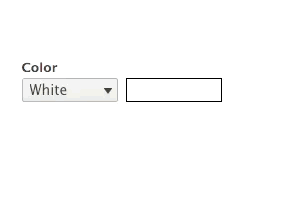
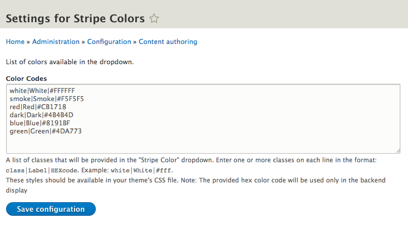

# stripe_color_field

Drupal 8 module. Special Dropdown to indicate color of a stripe.

# Usage

After install you will find a new field Type called `Stripe Color`. Use as desired.
Go to the settings page `/admin/config/content/stripe_color_field` and add the needed colors.

We normally add the new field named `Stripe Color` to a Paragraph called `Stripe`.
Then in the `paragraph--stripe.html.twig` we put the following:

``` twig


<section {{ attributes.addClass(classes) }} id="stripe-id-{{ paragraph.id() }}">
  {{ content.field_headline }}
  {{ content.field_inner_paragraphs }}
</section>

```

# Demo Screen

When placed into a field, it looks like this:



Backend settings page



# Credits

code base: [github.com/wearewondrous/stripe_color_field](https://github.com/wearewondrous/stripe_color_field/)

developed by [WONDROUS LLC](https://www.wearewondrous.com/)
